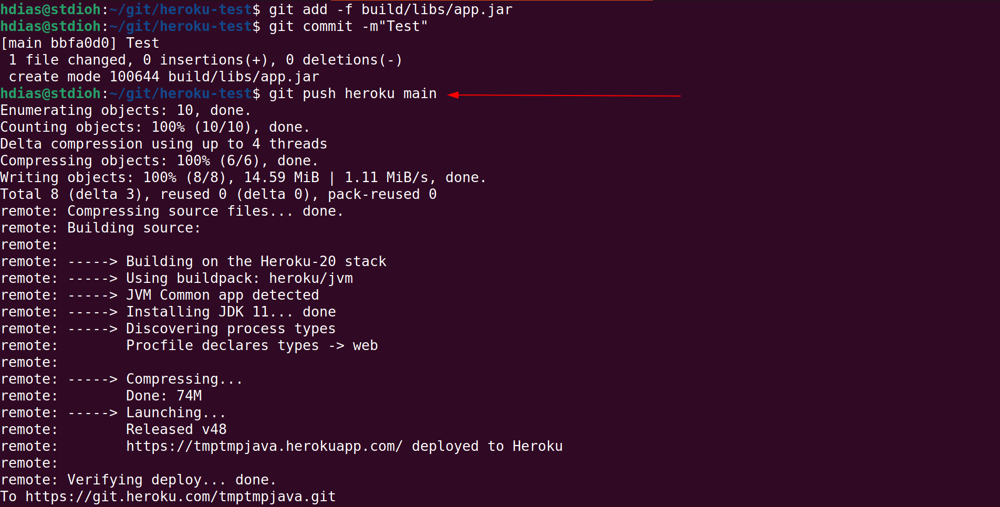
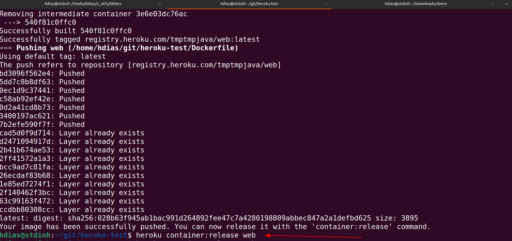
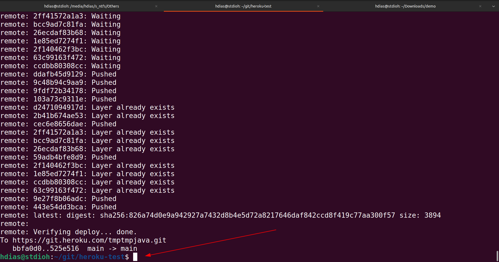

# heroku-test
Testing Heroku Deploy methods

For this test we will be using an application written in Java 11 with the Spring Boot framework and using gradle 7.

#Demo
###**https://tmptmpjava.herokuapp.com**

# ###IMPORTANT###
At the heroku's server they use the variable $PORT to hold the port that will be opened to the internet,
make sure to start your application using this port.
<br/><br/>


#First Steps
* Create an account at the **https://heroku.com**
* Create an application to be used in ours tests


# Deploy a Jar File
Ref: https://devcenter.heroku.com/articles/deploying-executable-jar-files
```
heroku login
heroku stack:set heroku-20 -a [APP_NAME]
heroku deploy:jar build/libs/app.jar -a [APP_NAME]

heroku open -a [APP_NAME]
```

If everything goes right, it will start to run at the heroku.

 **Heroku automatically will pass a variable $JAVA_OPTS to when run your application, and you can edit its values at the Heroku's Dashboard -> Settings**

Example how heroku runs your application: **java $JAVA_OPTS -jar app.jar**


 

#Deploy with Procfile
Ref: https://devcenter.heroku.com/articles/procfile

Specify the JRE version on the server: https://devcenter.heroku.com/articles/java-support#specifying-a-java-version


**To use the Procfile your project should be inside a git repository, and the Procfile should be placed in the root of the project**
```
cd [PATH_TO_PROJECT]
heroku login

# Should be done only once
# Adding the a new remote (heroku) to the heroku's git server  
heroku git:remote -a [APP_NAME]

# Execute your build
gradle clean build

# Create the Procfile and write in it
echo "web: java $JAVA_OPTS -jar build/libs/app.jar --server.port=$PORT" > Procfile

git add -A
git commit -m"My Build"
git push heroku main

heroku open -a [APP_NAME]
```




#Deploy with Dockerfile
Ref: https://devcenter.heroku.com/articles/container-registry-and-runtime

Create your Dockerfile in the root of the project with the steps to run the application using the variable $PORT

```
cd [PATH_TO_PROJECT]
heroku login

# Read the Dockerfile at the root of the repository

# Create the container locally then push it to the heroku's server
heroku container:push web -a [APP_NAME]
heroku container:release web

heroku open -a [APP_NAME]

```





#Deploy with heroku.yml and Dockerfile
Ref: https://devcenter.heroku.com/articles/build-docker-images-heroku-yml

Create your Dockerfile in the root of the project with the steps to run the application using the variable $PORT,
then create a heroku.yml at the root of the repository.

Read the heroku.yml at the root of the repository to get an example

```
cd [PATH_TO_PROJECT]
heroku login

git add -A
git commit -m"heroku.yml"

heroku stack:set container

git push heroku main


heroku open -a [APP_NAME]
```

Using the heroku.yml your docker container will be created and executed at the heroku's server, it should run faster than using only using the Dockerfile that create it locally then tries to deploy.




#References

* [Heroku](https://www.heroku.com)
* [Heroku - Deploy with JAR](https://devcenter.heroku.com/articles/deploying-executable-jar-files)
* [Heroku - Deploy with Procfile](https://devcenter.heroku.com/articles/procfile)
* [Heroku - Deploy with Dockerfile](https://devcenter.heroku.com/articles/container-registry-and-runtime)
* [Heroku - Deploy with heroku.yml](https://devcenter.heroku.com/articles/build-docker-images-heroku-yml)