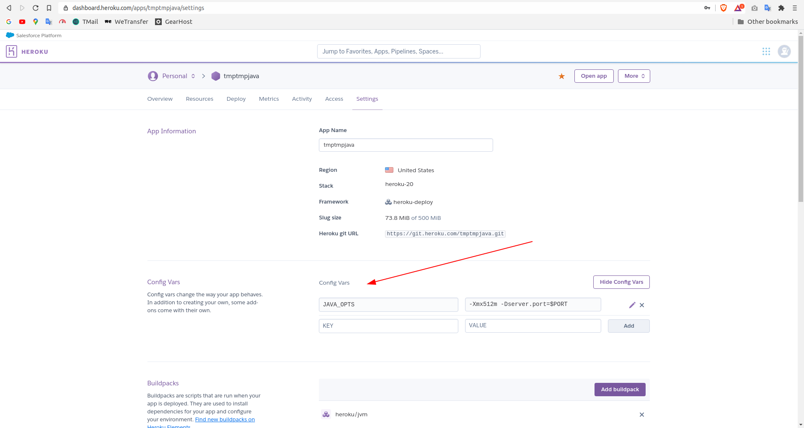

# heroku-test
Testing Heroku Deploy methods

For this test we will be using an application written in Java 11 using the Spring Boot framework.

#Demo
###**https://tmptmpjava.herokuapp.com**

# ###IMPORTANT###
At the heroku's server they use the variable $PORT to hold the port that will be opened to the internet,
make sure to start your application using this port.
<br/><br/>

# Deploy a Jar File
Ref: https://devcenter.heroku.com/articles/deploying-executable-jar-files
```
heroku login
heroku stack:set heroku-20 -a [APP_NAME]
heroku deploy:jar build/libs/app.jar -a [APP_NAME]
```

If everything goes right, it will start to run at the heroku.

 **Heroku automatically will pass a variable $JAVA_OPTS to when run your application, and you can edit its values at the Heroku's Dashboard -> Settings**

Example how heroku runs your application: **java $JAVA_OPTS -jar app.jar**



 

#Deploy with Procfile